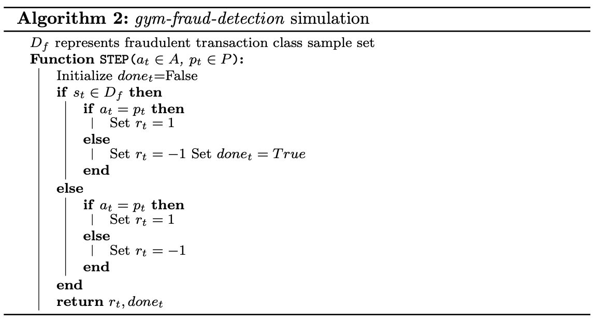

# Deep Reinforcement Learning for Credit Card Fraud Detection

* [How to create new gym environment in openai](https://github.com/openai/gym/blob/master/docs/creating-environments.md)

# Installation 
```
cd gym-fraud
pip install -e .
```

# Usage 

**Step - 1 :** Create a directory named *dataset* in your folder containing the main program.<br>
**Step - 2 :** Download [Kaggle's Credit Card Fraud Detection Dataset](https://www.kaggle.com/mlg-ulb/creditcardfraud) and place it inside *dataset folder*<br>
**Step - 3 :** In your code create an instance of gym_fraud environment using the following commands <br>

 ```python
import gym
import gym_fraud
env = gym.make('fraud-v0')
```

# Overview
Due to the rapid advancement in electronic commerce technology, the use of credit cards has
dramatically increased. The increasing popularity of credit
card as a payment mode for both online and regular
purchases has led to a rise in fraudulent cases of credit card
transactions. For many years, numerous supervised machine
learning models for anomaly detection have achieved
state-of-the-art performance. In this paper, we present a
novel deep Q-network architecture and a custom OpenAI
Gym environment for our deep reinforcement learning
agent that utilizes Experience Replay and uses value
function approximation. The deep Q-agent employs
epsilon-greedy policy to perform classification action based
on batches of input. The OpenAI environment then
evaluates the agent’s action and rewards the agent
accordingly. The agent’s memory stores this entire
experience. At the end of batch completion, the deep Q-agent
samples a batch of memory from its experience buffer and
updates the Q-value using the Q-network computes the loss
and performs back-propagation to update the weights.
Results show that our model successfully classified
fraudulent and non-fraudulent transactions and has
achieved state-of-the-art performance.

# Algorithm

</img>
</img>

# Results and Evaluation

Table 1 represents the accuracy score of various models that have been pro- posed for classifying fraudulent and non-fraudulent transactions. After ex- tensive training, our model was able to correctly classify fraudulent and non- fraudulent transaction with 90.29% accuracy on test data. <br><br>
A comparison of classification accuracy of multiple models discussed in section 4 against our DQN-based model is elaborated in Table 1.<br><br>
According to the results, artificial neural networks perform the best when given a classification problem such as credit-card fraud detection with 99% accuracy. Random forest model and Logistic Regression algorithm looks promising for our dataset. They have high true positive rate and low false positive rate. Our model has achieved state-of-the-art performance on a highly imbal- ance credit-card fraud data-set and was able to correctly classify fraudulent and non-fraudulent transactions 90.29% of the time. This accuracy opens the door to many opportunities of exploring the scope of reinforcement learning in the field of classification problems and decision making process. By exploring better reward functions and performing hyper-parameter tuning, we can increase the accuracy of our model even more.<br><br>

</img>

# Research Paper

<p style="text-color:red">In review.</p>
